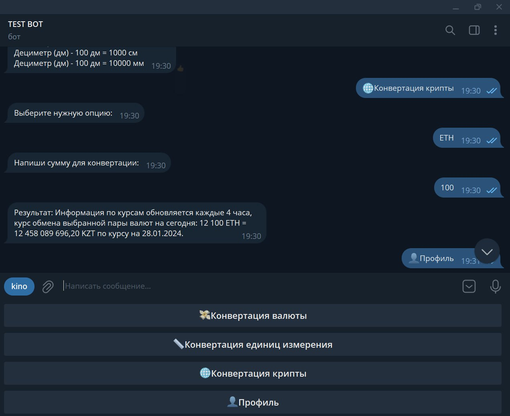

# Telegram Currency and Unit Converter Bot

## Overview

This Telegram bot simplifies currency and unit conversion tasks, providing users with convenient functionalities. Easily convert currencies using the latest exchange rates and perform unit conversions across various metrics—all within the Telegram platform.

## Table of Contents

- [Getting Started](#getting-started)
- [Prerequisites](#prerequisites)
- [Installation](#installation)
- [Usage](#usage)
- [Features](#features)
- [Contributing](#contributing)
- [License](#license)

## Getting Started

### Requirements

- [Python 3.x](https://www.python.org/)
- [Django](https://www.djangoproject.com/)
- [Telebot](https://github.com/eternnoir/pyTelegramBotAPI)

